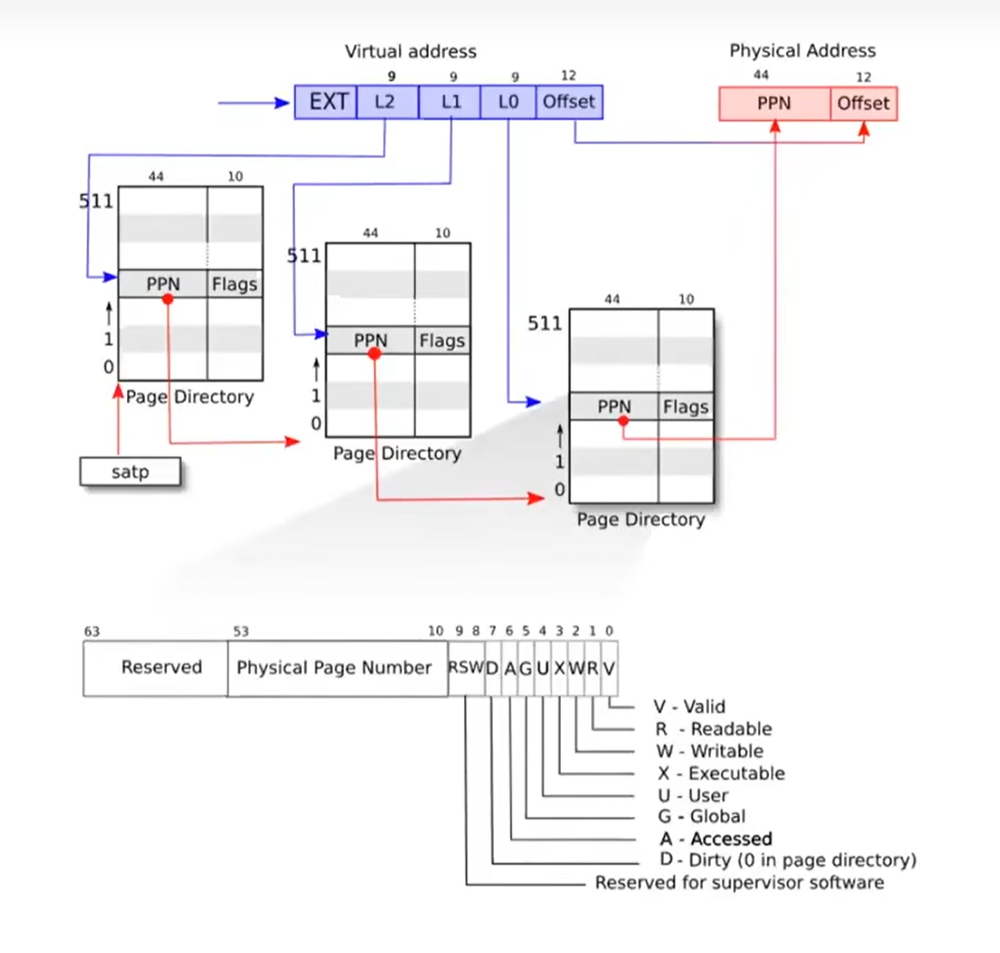

## The structure of the page table

- 1.va和pa都是64位但是有些高位都没用到

- **2.每一个page dir 都是一页的大小即4096b，存着512个64位的PTE，这里L2，L1，L0都是用来索引page dir中的PTE**

- **3.satp指定开始的page dir的物理地址，然后L2，L1的PPN都用来寻找下一级page dir的物理地址，L0的PPN即为pa的前44位**

- 4.图下方是PTE结构，**一个PTE包括了PPN和Flags**，如果通过walk函数寻址的过程中发现flags的V位为0，那么将返回page fault。其中前五位VRWXU都是比较重要的。