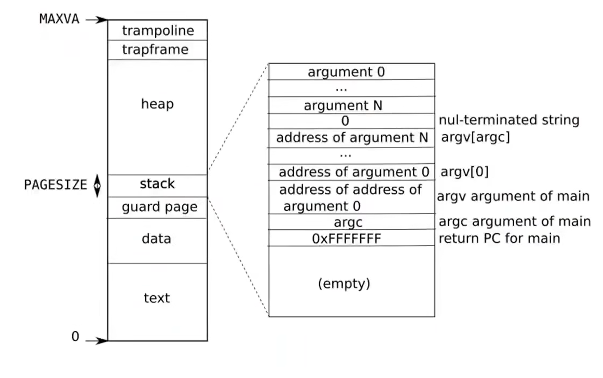

## Process va and Kernel va

- **1.同样是0~MAXVA(256G)，内核态和用户态看到的虚拟地址完全不同。**

| 虚拟地址区域        | 进程用户页表                    | 内核页表           |
| ------------- | ------------------------- | -------------- |
| 低地址           | 用户程序 text/data/stack/heap | 设备或未映射         |
| `KERNBASE` 附近 | 通常未映射                     | 内核代码、数据、RAM    |
| `KSTACK` 区域   | 未映射                       | 各进程内核栈         |
| `TRAPFRAME`   | 当前进程的 trapframe           | 通常没有相同映射       |
| `TRAMPOLINE`  | trampoline                | 同一个 trampoline |

- **2.trampoline 在用户页表和内核页表中：**
    - 使用相同虚拟地址TRAMPOLINE
    - 映射到同一个物理页
    - 用户态不能直接读写或执行，因为没有设置 PTE_U
    - ***所有satp的trampoline都在同一个物理地址***

- **3.trmpoline主要由uservec和userret组成**

- **4.satp存在用户态trapframe中**

---
### 概念

- **1..pagetable_t 实际保存的是根页表 L2 的地址。只要确定了这个根，后面的 L1、L0 就可以沿着非叶子 PTE 找到，所以它可以代表整套页表。**

- **2.每个进程都有自己的一棵三级用户页表树，并且拥有不同的 L2 根页表(由satp唯一确定)；运行该进程时，内核把这个根页表的物理页号写入 satp。**

- **3.进入内核后，所有进程的 satp 都切换到同一个内核 L2 根页表，因此使用同一棵内核三级页表树。**

- **4.根页表之上没有更高级的存在；操作系统通过 proc[].pagetable 管理所有根页表，通过物理页分配器管理物理内存，而 MMU只负责按照当前 satp 完成一次地址翻译。**