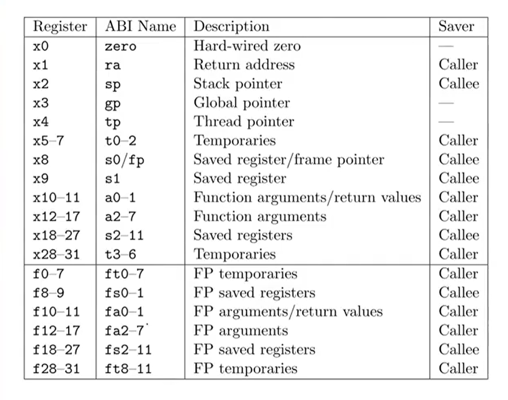

## RISC-V callint convetion and ASM of RISCV

- 1.**RISC-V 的函数调用约定（Calling Convention）：编译器生成函数调用代码时，参数放在哪里、返回值放在哪里、哪些寄存器需要保存，以及栈如何使用**

- 2.**主要寄存器**

- 3.caller-saved vs callee-saved(2,3见下图)

- 4.传参: 少于8个, a0 ~ a7  多于8个, 多出来的放栈帧

- 5.返回值:64位 -> a0, 128位 -> a0 ~ a1, 
    多于128位: 1.提前分配内存 2.将该内存地址作为第一个隐藏的参数传给函数

- 6.ra与返回地址: example: call func :1.**ra存储call func下一条指令地址** 2.pc -> func第一行地址 3.**ret总是使pc -> ra**

- 7.栈向低地址增长：
    - 划出栈帧 addi sp, sp, -32 (从sp到sp - 32的范围都属于本栈帧)
    - 释放栈帧 addi sp, sp, 32
    - 1.程序、线程建立时，OS分配一块地址。将sp初始化到高地址
    - 2.函数运行中，**sp只是移动，不参与分配内存**

- 8.RV64标准： char 1 short 2 int 4 long 8 long long 8 void* 8

