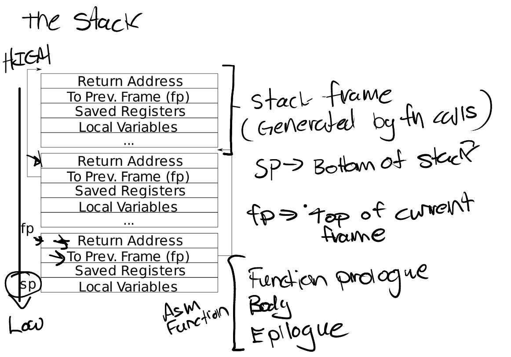

### 栈layout


### C 的内联汇编 : C代码读取寄存器

- kernel/riscv.h/r_fp

```c
static inline uint64
r_fp()
{
  uint64 x;
  asm volatile("mv %0, s0" : "=r" (x) );
  return x;
}
```

- 这是 GCC 的扩展内联汇编。编译器会把其中的汇编指令插入生成的机器代码中。

- volatile 表示这段汇编不能因编译器优化而被随意删除或移动。
---
- "mv %0, sp"：执行寄存器复制

- "=r"(x)：将汇编输出关联到 C 变量 : %0 -> x

- %0是第0个操作数

- 编译器为 "=r"(x) 选择一个通用寄存器，例如 a5。

- %0 被替换为该寄存器